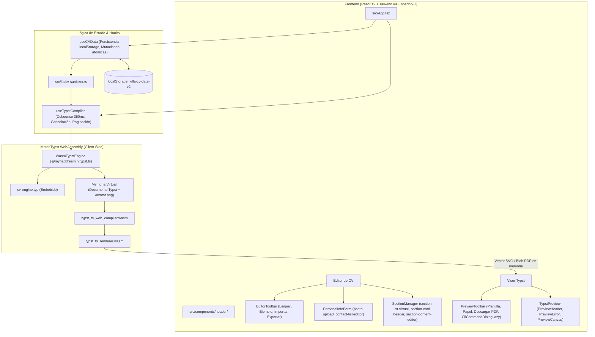

# Killa CV — Arquitectura del Sistema y Guía de Referencia

Este documento consolida la arquitectura completa, el flujo de datos, el protocolo de compilación y la estructura de componentes de **Killa CV**. Su propósito es servir como **fuente única de verdad** para que cualquier desarrollador o agente de IA comprenda de forma inmediata el funcionamiento del proyecto sin necesidad de inspeccionar cada archivo.

---

## 1. Misión y Tecnologías Principales

**Killa CV** es una plataforma de maquetación y generación de currículums de alta precisión, **100% local y sin dependencias en la nube**:

- **Motor de Renderizado Documental:** [Typst v0.15+](https://typst.app/) compilado directamente en WebAssembly en el navegador (`@myriaddreamin/typst.ts`).
- **Frontend:** React 19 + TypeScript + Vite 8 (motor Rolldown).
- **Estilos:** Tailwind CSS v4 (motor CSS-First con `@theme inline` y espacio de color OKLCH, paleta aeroespacial **Cyber Lunar**).
- **Componentes UI:** [shadcn/ui](https://ui.shadcn.com/) (estilo `base-nova`, apoyado en `@base-ui/react` para Dialog y DropdownMenu, primitivas puras en HTML para Button, Input, Badge, Separator, Avatar).
- **Arquitectura de Ejecución:** SPA 100% Client-Side sin servidores ni middlewares de backend. Compilación vectorial SVG y generación de binarios PDF directamente en memoria del navegador.

---

## 2. Diagrama de Arquitectura Global




---

## 3. Esquema Universal de Datos (`cv.schema.json`)

El archivo [`src/assets/cv.schema.json`](file:///home/red-mat/Proyectos/killa-cv/src/assets/cv.schema.json) dicta la estructura estricta con `additionalProperties: false`.

### 3.1. Estructura Raíz
```json
{
  "$schema": "assets/cv.schema.json",
  "plantilla": "harvard",          // "harvard" | "modern"
  "datos_personales": { ... },
  "secciones": [ ... ]
}
```

### 3.2. Datos Personales (`datos_personales`)
- `nombre_completo` (*string, requerido*): Nombre del candidato.
- `titulo` (*string, opcional*): Especialidad o cargo profesional.
- `foto` (*string, opcional*): Data URI en Base64 (`data:image/jpeg;base64,...`) o ruta local a disco.
- `fecha_nacimiento` (*string, opcional*): Fecha de nacimiento (ej. `1995-01-01`).
- `contacto` (*array de objetos, requerido*): Cada ítem `{ tipo: string, valor: string, url?: string }` (ej. `email`, `telefono`, `linkedin`, `github`, `ubicacion`, `portfolio`, `blog`).

### 3.3. Tipos Polimórficos de Sección (`secciones[]`)
Cada sección se identifica por la clave discriminante `tipo`:

| Tipo | Título Típico | Estructura de Datos | Uso en Typst |
| :--- | :--- | :--- | :--- |
| **`texto`** | `PERFIL PROFESIONAL`, `OBJETIVOS` | `{ titulo, tipo: "texto", contenido: string }` | Párrafo narrativo corrido y justificado. |
| **`entradas`** | `EXPERIENCIA LABORAL`, `EDUCACIÓN`, `PROYECTOS` | `{ titulo, tipo: "entradas", items: EntradaItem[] }` | Cronología Harvard de doble nivel (Empresa/Institución, Fechas, Rol, Ubicación, Descripción y lista de viñetas). |
| **`agrupado`** | `HABILIDADES TÉCNICAS`, `IDIOMAS`, `CURSOS` | `{ titulo, tipo: "agrupado", grupos: GrupoItem[] }` | Categorías en negrita con etiquetas/chips o elementos separados por comas. |
| **`lista`** | `CERTIFICACIONES`, `PASATIEMPOS`, `LOGROS` | `{ titulo, tipo: "lista", elementos: string[] }` | Lista de viñetas directas. |

---

## 4. Motor de Plantillas Typst (`cv-engine.typ`)

Ubicado en [`src/assets/cv-engine.typ`](file:///home/red-mat/Proyectos/killa-cv/src/assets/cv-engine.typ):
- Lee los datos mediante `sys.inputs.data` (soporta JSON en memoria o ruta relativa al `--root`).
- Lee la plantilla mediante `sys.inputs.plantilla` (`"harvard"` o `"modern"`).
- Lee el formato de papel mediante `sys.inputs.paper` (`"a4"` o `"us-letter"`).
- Renderiza el avatar en Base64 mediante el paquete `@preview/based:0.2.0`.
- Itera dinámicamente las secciones de acuerdo con su `tipo` sin importar la cantidad ni el nombre de las mismas.

### Comando CLI de Compilación Canónico:
```bash
typst compile \
  --root . \
  --input data=.killa-cache/cv.json \
  --input plantilla=harvard \
  --input paper=a4 \
  src/assets/cv-engine.typ \
  salida-{p}.svg
```

---

## 5. Bridge Local con Vite (`vite-plugins/typst-compiler.ts`)

Para evitar servidores backend externos o binarios pesados de WebAssembly en el navegador, el servidor de desarrollo Vite (`vite.config.ts`) expone tres endpoints HTTP internos:

1. **`GET /api/typst/status`**:
   - Ejecuta `typst --version`.
   - Retorna `{ ok: true, version: "typst 0.15.1 (...)" }`.
2. **`POST /api/typst/compile-svg`**:
   - Recibe `{ data: CVData, plantilla: string, paper: string }`.
   - Escribe el JSON sanitizado en `.killa-cache/cv.json`.
   - Ejecuta `typst compile --root . ... preview-{p}.svg`.
   - Lee todos los SVGs generados y retorna `{ ok: true, pages: string[], totalPages: number }`.
3. **`POST /api/typst/compile-pdf`**:
   - Ejecuta `typst compile --root . ... cv.pdf`.
   - Retorna el buffer binario del PDF con `Content-Type: application/pdf` para descarga instantánea.

---

## 6. Mapa del Código Fuente

```text
killa-cv/
├── src/
│   ├── assets/
│   │   ├── cv.schema.json           # Especificación formal JSON Schema (v2020-12)
│   │   └── cv-engine.typ            # Motor de maquetación Typst universal
│   ├── types/
│   │   └── cv.ts                    # Interfaces TypeScript derivadas del esquema
│   ├── lib/
│   │   ├── cv-defaults.ts           # DEFAULT_CV (John Doe), EMPTY_CV, generadores y presets
│   │   ├── cv-sanitizer.ts          # Limpieza de datos (elimina ids de React y campos vacíos)
│   │   └── utils.ts                 # Utilidad cn() para clases de Tailwind
│   ├── services/
│   │   └── typst-service.ts         # Cliente HTTP con AbortController, debounce y descarga PDF
│   ├── components/
│   │   ├── header/
│   │   │   ├── index.tsx            # Header de la aplicación con telemetría Cyber Lunar
│   │   │   └── theme-toggle.tsx     # Selector de tema Dark / Light / System
│   │   ├── editor/
│   │   │   ├── editor-toolbar.tsx   # Barra de acciones de datos (Limpiar, Ejemplo, Importar, Exportar)
│   │   │   ├── personal-info-form.tsx # Formulario de datos personales y contactos dinámicos
│   │   │   ├── section-manager.tsx  # Orquestador virtualizado de secciones (TanStack Virtualizer, colapsadas por defecto, reordenamiento)
│   │   │   ├── add-section-dialog.tsx # Modal con plantillas rápidas y creador libre
│   │   │   └── sections/
│   │   │       ├── text-section-editor.tsx     # Editor de texto corrido
│   │   │       ├── entries-section-editor.tsx  # Editor de timeline doble Harvard + viñetas
│   │   │       ├── grouped-section-editor.tsx  # Editor de categorías y chips de tags
│   │   │       └── list-section-editor.tsx     # Editor de lista simple
│   │   ├── preview/
│   │   │   ├── preview-toolbar.tsx  # Controles de plantilla (Harvard/Modern), papel y descarga PDF
│   │   │   └── typst-preview.tsx    # Visor SVG con sombra física, zoom (60-160%) y paginador
│   │   └── ui/                      # Primitivas shadcn/ui (Button, Card, Input, Tabs, Dialog, etc.)
│   ├── App.tsx                      # Layout dual split-screen / tabs móvil y sincronización reactiva
│   └── index.css                    # Tokens @theme inline, paleta Cyber Lunar OKLCH y fuentes
├── public/
│   ├── logo-luna.png                # Isotipo principal e identidad visual lunar
│   └── logo-LUNA-MONTAIN2.png       # Master original de alta resolución
├── index.html                       # Documento raíz con favicon enlazado a /logo-luna.png
├── vite-plugins/
│   └── typst-compiler.ts            # Plugin nativo de Vite con el bridge Typst CLI
├── .killa-cache/                    # Directorio gitignored para compilaciones intermedias
├── ARCHITECTURE.md                  # Este documento
├── DESIGN.md                        # Guía de tokens de diseño y paleta Cyber Lunar
├── vite.config.ts                   # Configuración de Vite con Tailwind v4 y React Compiler
└── package.json
```

---

## 7. Decisiones de Diseño y Patrones Clave

1. **Virtualización de Secciones con TanStack Virtualizer (`@tanstack/react-virtual`):**
   - Renderiza únicamente las secciones visibles en el viewport más un buffer de `overscan: 3`.
   - Soporta alturas dinámicas polimórficas mediante `measureElement` (apoyado en `ResizeObserver`) para recalibrar automáticamente cuando una sección se expande, colapsa o incrementa sus viñetas.
   - El contenedor de scroll (`max-h-[calc(100vh-280px)]`) mantiene anclados y siempre visibles los botones "Plegar/Desplegar Todas" y "Añadir Sección".
   - Cada tarjeta mantiene su identidad reactiva vía `getItemKey: sec.id`, preservando el foco y evitando pérdidas de estado durante la edición.

2. **Secciones Colapsadas por Defecto:**
   - Para no sobrecargar la vista, todas las secciones arrancan plegadas (`collapsed[key] ?? true`).
   - La tarjeta de **Datos Personales** permanece siempre visible como cabecera.
   - Existen botones globales **"Plegar Todas"** y **"Desplegar Todas"**.
   - Al añadir una nueva sección, esta se **despliega y se hace auto-scroll hacia ella automáticamente**.

3. **Sanitización de Datos Antes de Enviar a Typst:**
   - React utiliza `id: string` para renderizar listas eficientemente.
   - `sanitizeCVData()` en [`src/lib/cv-sanitizer.ts`](file:///home/red-mat/Proyectos/killa-cv/src/lib/cv-sanitizer.ts) elimina estos campos auxiliares y remueve cadenas vacías, garantizando que el JSON cumpla con `additionalProperties: false`.

3. **Separación de Responsabilidades en Barras de Herramientas:**
   - **EditorToolbar (Izquierda):** Acciones sobre los datos (`Limpiar Datos`, `Cargar Ejemplo`, `Importar cv.json`, `Exportar cv.json`).
   - **PreviewToolbar (Derecha):** Opciones de visualización y salida (`Plantilla`, `Papel`, `Comando CLI`, `Descargar PDF`).

4. **Persistencia en el Navegador:**
   - Los datos se guardan reactivamente en `localStorage` bajo la clave `'killa-cv-data-v2'`.

---

## 8. Comandos de Mantenimiento y Desarrollo

```bash
# Iniciar entorno de desarrollo local con Vite + Bridge Typst
pnpm run dev

# Compilar aplicación para producción con verificación de tipos
pnpm run build

# Ejecutar linter ultrarrápido (oxlint)
pnpm run lint
```

---

## 9. Rendimiento, Bundling y Roadmaps de Optimización

Para la planificación de empaquetado, presupuestos de rendimiento (*Performance Budgets*) y mitigación de advertencias de tamaño de chunks en Vite 8 / Rolldown, consultar:
- [Roadmap de Refactorización y Optimización de Bundles](file:///mnt/datos/Proyectos/killa-cv/docs/ROADMAP_REFACTORIZACION.md)

