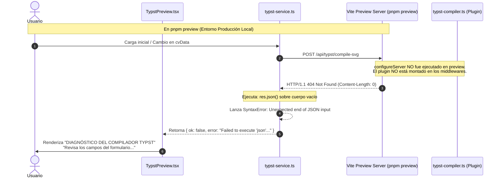

# INFORME DE CONTROL DE CALIDAD (QA DEFECT REPORT)
## Análisis Causa Raíz: Fallo de Compilación Typst en Entorno de Producción / Preview

| Metadato | Detalle |
| :--- | :--- |
| **ID de Defecto:** | `DEF-001-TYPST-PROD-PREVIEW` |
| **Título:** | Fallo de deserialización JSON en `TypstPreview` durante `pnpm preview` (`Failed to execute 'json' on 'Response'`) |
| **Severidad:** | **Crítica (Bloqueante / Blocker)** — Impide la visualización y exportación de currículums en versiones de producción. |
| **Prioridad:** | **P1 (Urgente)** |
| **Rol Emisor:** | Analista de Aseguramiento de Calidad (QA Lead / Systems QA Analyst) |
| **Fecha de Emisión:** | 2026-09-27 |
| **Estado:** | **TRIAGED / CAUSA RAÍZ IDENTIFICADA** (No solucionado en código por directriz QA) |
| **Componentes Afectados:** | `vite-plugins/typst-compiler.ts`, `src/services/typst-service.ts`, `src/components/preview/typst-preview.tsx` |

---

## 1. Resumen Ejecutivo del Incidente

Al compilar la aplicación para producción mediante `pnpm build` y servirla a través del servidor de previsualización estándar `pnpm preview`, el visor de Typst entra inmediatamente en estado de fallo.

La interfaz de usuario despliega:
- **Badge superior:** `Error de Maquetación`
- **Cabecera de diagnóstico:** `DIAGNÓSTICO DEL COMPILADOR TYPST`
- **Mensaje de excepción:** `Failed to execute 'json' on 'Response': Unexpected end of JSON input`
- **Mensaje al usuario:** `Revisa los campos del formulario para corregir el valor inválido.`

### Diagnóstico Preliminar de QA
El mensaje presentado al usuario es un **falso diagnóstico**. El fallo **no** se debe a datos inválidos en los formularios del usuario ni a errores de sintaxis en el motor de maquetación Typst (`cv-engine.typ`). Se trata de una **ruptura en la capa de comunicación cliente-servidor** debida a que los endpoints de compilación `/api/typst/*` no existen en el entorno de previsualización o producción estática.

---

## 2. Pasos para Reproducir el Defecto (Reproduction Steps)

1. En el directorio raíz del proyecto, compilar los artefactos de producción:
   ```bash
   pnpm build
   ```
2. Iniciar el servidor de previsualización de producción de Vite:
   ```bash
   pnpm preview --port 4173
   ```
3. Abrir un navegador web y navegar a `http://localhost:4173/`.
4. Observar la columna derecha (panel de vista previa del currículum).

### Comportamiento Observado (Actual)
El visor muestra un recuadro de error rojo con el título *DIAGNÓSTICO DEL COMPILADOR TYPST* y la traza `Failed to execute 'json' on 'Response': Unexpected end of JSON input`. No se visualiza ninguna página del CV.

### Comportamiento Esperado (Expected)
El visor debería compilar reactivamente los datos de ejemplo predeterminados y renderizar las páginas SVG del documento vectorial, tal como ocurre en el entorno de desarrollo (`pnpm dev`).

---

## 3. Matriz Comparativa de Entornos

| Prueba / Criterio | Modo Desarrollo (`pnpm dev`) | Modo Preview (`pnpm preview`) | Producción Estática (Vercel / S3) |
| :--- | :---: | :---: | :---: |
| **Comando de Ejecución** | `vite` | `vite preview` | `nginx` / CDN estático |
| **Hook de Plugin Vite** | `configureServer` (Activo) | `configureServer` (**No se ejecuta**) | N/A (Sin runtime de Vite) |
| **Respuesta `GET /api/typst/status`** | `HTTP 200 OK` (JSON con versión) | `HTTP 404 Not Found` (Cuerpo vacío) | `HTTP 404 Not Found` |
| **Respuesta `POST /api/typst/compile-svg`**| `HTTP 200 OK` (JSON con páginas SVG)| `HTTP 404 Not Found` (Cuerpo vacío) | `HTTP 404 Not Found` |
| **Resultado en el Visor** | **Renderizado Exitoso (En Vivo)** | **Error de Maquetación (Falso Positivo)** | **Error de Maquetación (Falso Positivo)** |

---

## 4. Análisis Técnico Detallado de Causa Raíz (RCA)

La investigación de QA revela una concurrencia de **tres fallos interconectados** en diferentes capas de la arquitectura:



---

### Causa Raíz 1: Ausencia del Hook `configurePreviewServer` en el Plugin de Vite

En [`vite-plugins/typst-compiler.ts`](file:///mnt/datos/Proyectos/killa-cv/vite-plugins/typst-compiler.ts#L29-L43):
```typescript
export function typstCompilerPlugin(): Plugin {
  ...
  return {
    name: 'vite-plugin-typst-compiler',
    configureServer(server) {
      // Middleware de desarrollo
      server.middlewares.use(async (req, res, next) => {
        if (url === '/api/typst/status' ...) { ... }
        if (url === '/api/typst/compile-svg' ...) { ... }
        if (url === '/api/typst/compile-pdf' ...) { ... }
      })
    }
  }
}
```

* **Explicación:** De acuerdo con la especificación de Vite, el hook `configureServer(server)` está destinado **exclusivamente al servidor de desarrollo** (`vite dev`). Cuando se ejecuta `vite preview`, Vite instancia un servidor HTTP independiente y llama al hook `configurePreviewServer(server)`.
* **Consecuencia:** Como `configurePreviewServer` no está implementado, las rutas `/api/typst/*` no son registradas. El servidor de preview no encuentra los recursos y devuelve:
  ```http
  HTTP/1.1 404 Not Found
  Content-Length: 0
  ```

---

### Causa Raíz 2: Falta de Validación Defensiva en el Cliente HTTP (`src/services/typst-service.ts`)

En [`src/services/typst-service.ts`](file:///mnt/datos/Proyectos/killa-cv/src/services/typst-service.ts#L32-L68):
```typescript
export async function compileTypstSVG(...) {
  try {
    const cleanData = sanitizeCVData(cvData)
    const res = await fetch('/api/typst/compile-svg', {
      method: 'POST',
      headers: { 'Content-Type': 'application/json' },
      body: JSON.stringify({ data: cleanData, plantilla, paper }),
      signal,
    })

    const result = await res.json() // <-- FALLO AQUÍ
    if (!res.ok || !result.ok) {
      return { ok: false, pages: [], totalPages: 0, error: result.error || ... }
    }
    ...
```

* **Explicación:** La función asume de forma no determinista que toda respuesta de red contiene un cuerpo con formato JSON legible. La invocación `await res.json()` se realiza **antes** de verificar si el código de respuesta HTTP fue exitoso (`res.ok`) o si las cabeceras declaran `application/json`.
* **Consecuencia:** Cuando el servidor responde con `HTTP 404` y un cuerpo vacío (`Content-Length: 0`), el método nativo `Response.prototype.json()` del navegador falla al no encontrar tokens JSON, lanzando la excepción:
  ```text
  SyntaxError: Failed to execute 'json' on 'Response': Unexpected end of JSON input
  ```
  Esta excepción es capturada por el bloque `catch (err)` y propagada directamente como mensaje de error al estado de la aplicación.

---

### Causa Raíz 3: Diagnóstico Engañoso en la Capa de Presentación (`src/components/preview/typst-preview.tsx`)

En [`src/components/preview/typst-preview.tsx`](file:///mnt/datos/Proyectos/killa-cv/src/components/preview/typst-preview.tsx#L142-L154):
```tsx
{error ? (
  <div className="w-full max-w-md p-4 rounded-xl border border-destructive/40 bg-destructive/10 text-destructive-foreground space-y-2">
    <div className="flex items-center gap-2 font-heading font-semibold text-xs text-destructive">
      <AlertTriangle className="size-4" />
      <span>DIAGNÓSTICO DEL COMPILADOR TYPST</span>
    </div>
    <pre className="text-[11px] font-mono whitespace-pre-wrap overflow-x-auto p-2 rounded bg-black/40 text-destructive/90 max-h-60">
      {error}
    </pre>
    <p className="text-[11px] text-muted-foreground">
      Revisa los campos del formulario para corregir el valor inválido.
    </p>
  </div>
) : ...
```

* **Explicación:** La interfaz de usuario trata todos los errores como errores de compilación semántica de Typst atribuibles a los datos ingresados por el usuario. No existe distinción entre:
  1. **Errores de Red / Infraestructura:** Conexión rechazada, endpoints no encontrados (HTTP 404), servidores caídos (HTTP 500/502).
  2. **Errores de Formato de Protocolo:** Respuestas no-JSON, cuerpos vacíos.
  3. **Errores de Compilación de Typst:** Salida `stderr` generada por el compilador `typst compile`.
* **Consecuencia:** El usuario o tester asume erróneamente que ha introducido caracteres inválidos en el formulario cuando el fallo es de infraestructura.

---

### Causa Raíz 4: Desacoplamiento de Arquitectura para Producción Real

El documento de arquitectura [`ARCHITECTURE.md`](file:///mnt/datos/Proyectos/killa-cv/ARCHITECTURE.md#L15) describe el proyecto como *"100% local y sin dependencias en la nube"*, utilizando el CLI nativo de Linux:
- En desarrollo y en preview local, esto depende de que la máquina ejecutando el servidor cuente con `typst` instalado y con permisos para ejecutar procesos hijos vía `child_process.execFile`.
- Si el build generado en `dist/` se despliega en un hosting estático (como GitHub Pages, Vercel o AWS S3), no existe un servidor Node.js intermediario para ejecutar comandos CLI en el sistema operativo.

---

## 5. Evidencias de Pruebas Realizadas por QA

### Prueba 1: Petición HTTP al Servidor Preview (`pnpm preview`)
```bash
curl -i -X POST http://localhost:4173/api/typst/compile-svg \
  -H "Content-Type: application/json" \
  -d '{"data":{}}'
```
**Resultado Obtenido:**
```http
HTTP/1.1 404 Not Found
Vary: Origin
Date: Sun, 27 Sep 2026 22:00:54 GMT
Connection: keep-alive
Keep-Alive: timeout=5
Content-Length: 0
```
*(Confirma que el servidor preview rechaza la ruta con 404 y cuerpo vacío).*

---

### Prueba 2: Petición HTTP al Servidor de Desarrollo (`pnpm dev`)
```bash
curl -i -X POST http://localhost:5174/api/typst/compile-svg \
  -H "Content-Type: application/json" \
  -d '{"data":{}}'
```
**Resultado Obtenido:**
```http
HTTP/1.1 200 OK
Content-Type: application/json
...
{"ok":true,"pages":[...],"totalPages":1}
```
*(Confirma que en modo dev el middleware sí está registrado y responde adecuadamente).*

---

## 6. Recomendaciones Formales para el Equipo de Desarrollo

Desde el área de QA se sugieren las siguientes líneas de acción técnica (a ser evaluadas e implementadas por el equipo de desarrollo):

### Recomendación 1: Habilitar Middleware en `configurePreviewServer` (Solución Inmediata para Preview Local)
Refactorizar el middleware en una función reutilizable y registrarla tanto en `configureServer` como en `configurePreviewServer`:
```typescript
// vite-plugins/typst-compiler.ts
export function typstCompilerPlugin(): Plugin {
  return {
    name: 'vite-plugin-typst-compiler',
    configureServer(server) {
      server.middlewares.use(createTypstMiddleware(server.config.root))
    },
    configurePreviewServer(server) {
      server.middlewares.use(createTypstMiddleware(server.config.root))
    }
  }
}
```

### Recomendación 2: Programación Defensiva en `src/services/typst-service.ts`
1. Validar el estado HTTP antes de procesar el cuerpo:
   ```typescript
   if (!res.ok) {
     const errorText = await res.text().catch(() => '')
     let errorJson
     try { errorJson = JSON.parse(errorText) } catch {}
     return {
       ok: false,
       pages: [],
       totalPages: 0,
       error: errorJson?.error || `Error del servidor (${res.status} ${res.statusText})`,
     }
   }
   ```
2. Verificar el encabezado `Content-Type` antes de invocar `res.json()`.

### Recomendación 3: Clasificación de Errores en `TypstPreview.tsx`
Diferenciar en la UI entre:
- **Error de Conexión/Servidor:** *"No se pudo comunicar con el servicio de compilación Typst (HTTP 404/500)."*
- **Error de Maquetación de Typst:** *"El compilador reportó un error de formato en el documento."*

### Recomendación 4: Definir la Estrategia de Producción a Largo Plazo
Determinar si la aplicación final será:
- **Aplicación de Escritorio / Local Server:** Distribuida con backend Node.js integrado (ej. Electron / Tauri / CLI local).
- **Web App 100% Client-Side:** Migrar el motor de compilación a WebAssembly mediante `@myriaddreamin/typst.ts` o `@typst/typst-wasm`, eliminando la necesidad de middlewares y binarios del SO anfitrión.

---

## 7. Criterios de Aceptación para Verificación QA (Checklist de Re-test)

Una vez que el equipo de desarrollo notifique la corrección, QA validará:

- [ ] **TC-01:** Ejecutar `pnpm build` y `pnpm preview`; la página inicial debe cargar y renderizar el CV en SVG sin errores en consola.
- [ ] **TC-02:** El badge superior debe indicar `En Vivo // Typst 0.15` y no `Error de Maquetación`.
- [ ] **TC-03:** La descarga de PDF vía `POST /api/typst/compile-pdf` debe generar un archivo descargable válido en modo preview.
- [ ] **TC-04:** Simular una desconexión o fallo 404 forzado; la UI debe mostrar un mensaje amigable de fallo de conexión y no una traza de fallo JSON ni acusar al usuario de campos inválidos.
