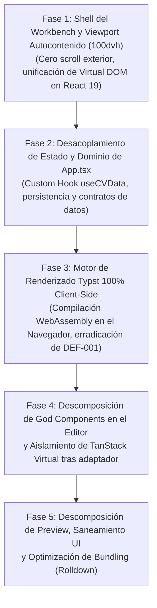

# Killa CV — Roadmap Maestro de Refactorización: Arquitectura Limpia y SPA 100% Client-Side

> **Documento Oficial de Arquitectura y Planificación por Fases (SSOT)**  
> **Versión:** 3.0.0  
> **Fecha:** 2026-09-27  
> **Estado:** Aprobado — Listo para Ejecución  
> **Paradigma:** Single Page Application (SPA) 100% Client-Side (Ejecución y Renderizado en el Navegador con WebAssembly)  
> **Stack:** React 19.2.8 (React Compiler) · Vite 8.3.1 (Rolldown) · Tailwind CSS v4 · Base UI / shadcn

---

## 1. Misión del Proyecto y Cambio de Paradigma Arquitectónico

### 1.1. Adiós a "Construir sobre la Arena"
Las versiones preliminares del proyecto dependían de un middleware en Node.js dentro de Vite (`child_process.execFile("typst", ...)`). Como evidenció el informe de QA [**`docs/INFORME_QA_DEFECTO_COMPILADOR_PRODUCCION.md`**](file:///mnt/datos/Proyectos/killa-cv/docs/INFORME_QA_DEFECTO_COMPILADOR_PRODUCCION.md) (`DEF-001-TYPST-PROD-PREVIEW`), ese enfoque colapsaba en cualquier entorno sin servidor de desarrollo (como `pnpm preview` o despliegues estáticos en Vercel, S3 o GitHub Pages).

Intentar parchar un servidor Node inexistente en producción era **construir sobre la arena**.

### 1.2. Los 4 Pilares de la Nueva Arquitectura

1. **SPA 100% Client-Side con WebAssembly:**  
   Killa CV se ejecuta, procesa y renderiza **exclusivamente en el navegador del cliente**. La compilación de Typst se traslada al motor WebAssembly en el cliente (`@myriaddreamin/typst.ts`), eliminando de raíz la necesidad de peticiones HTTP locales, middlewares de backend o binarios instalados en el sistema operativo anfitrión.
2. **Workbench Autocontenido (`100dvh`):**  
   La aplicación es una estación de trabajo de alta fidelidad delimitada a la pantalla física (`h-dvh flex flex-col overflow-hidden`). La ventana global del navegador **nunca muestra barras de desplazamiento vertical**; el desplazamiento se gestiona internamente en la columna del editor.
3. **Descomposición Sistemática de "God Components":**  
   Desmantelar todos los componentes monolíticos que acumulan múltiples responsabilidades (inputs, FileReader, subida de fotos, gestión de arrays anidados y diálogos incrustados) en componentes atómicos y reutilizables.
4. **Aislamiento de Dependencias Volátiles (TanStack Virtual):**  
   Mantener `@tanstack/react-virtual` activo por el momento, pero confinado estrictamente detrás del adaptador `SectionListVirtual`. Esto garantiza que cuando se decida eliminar la librería, sea un cambio trivial de 1 sola línea de código.

---

## 2. Mapa Arquitectónico de God Components a Descomponer

```
┌────────────────────────────────────────────────────────────────────────┐
│                        MAPA DE GOD COMPONENTS                          │
├────────────────────────────────────────────────────────────────────────┤
│ 1. App.tsx (271 líneas):                                               │
│    - 8 estados reactivos mezclados con I/O y persistencia              │
│    - Renderiza doble árbol (móvil y desktop) en el Virtual DOM         │
├────────────────────────────────────────────────────────────────────────┤
│ 2. PersonalInfoForm.tsx (269 líneas):                                  │
│    - Inputs de perfil + FileReader con subida de fotos Base64          │
│    - Gestión manual de arrays de contactos (12 cols grid por fila)     │
├────────────────────────────────────────────────────────────────────────┤
│ 3. SectionManager.tsx (347 líneas):                                    │
│    - Virtualizador TanStack + Toolbar colapso + Reordenamiento         │
│    - Tarjetas de sección + Despacho de editores polimórficos           │
├────────────────────────────────────────────────────────────────────────┤
│ 4. EntriesSectionEditor.tsx (214 líneas) y Grouped (158 líneas):       │
│    - Entries: lista + formulario de entidad + lista anidada de viñetas │
│    - Grouped: lista + tags badge + estado `Record<number, string>`     │
├────────────────────────────────────────────────────────────────────────┤
│ 5. PreviewToolbar.tsx (194 líneas):                                    │
│    - Dropdowns de plantilla y papel + Botón de PDF con animación       │
│    - Diálogo modal completo de CLI Typst con portapapeles incrustado   │
├────────────────────────────────────────────────────────────────────────┤
│ 6. TypstPreview.tsx (180 líneas):                                      │
│    - Barra de estado y zoom + Canvas SVG + Diagnóstico de error        │
└────────────────────────────────────────────────────────────────────────┘
```

---

## 3. Modelo Visual del Viewport Autocontenido (`100dvh`)

```
┌──────────────────────────────────────────────────────────────────────────┐
│ Window Body (h-dvh flex flex-col overflow-hidden bg-background)          │
│ ┌──────────────────────────────────────────────────────────────────────┐ │
│ │ Header (h-16 shrink-0 border-b border-border/80)                     │ │
│ │ Logo Killa CV                Separador | Modo Oscuro / Claro         │ │
│ └──────────────────────────────────────────────────────────────────────┘ │
│ ┌──────────────────────────────────────────────────────────────────────┐ │
│ │ Main Container (flex-1 min-h-0 w-full max-w-[1800px] p-4)            │ │
│ │ ┌───────────────────────────────┬──────────────────────────────────┐ │ │
│ │ │ Columna Editor:               │ Columna Preview:                 │ │ │
│ │ │ (h-full min-h-0               │ (h-full min-h-0 flex flex-col    │ │ │
│ │ │  overflow-y-auto pr-2         │  space-y-3)                      │ │ │
│ │ │  scrollbar-thin)              │                                  │ │ │
│ │ │                               │ ┌──────────────────────────────┐ │ │ │
│ │ │ 1. EditorToolbar              │ │ PreviewToolbar (shrink-0)    │ │ │ │
│ │ │ 2. PersonalInfoForm           │ └──────────────────────────────┘ │ │ │
│ │ │    - ProfileFields            │ ┌──────────────────────────────┐ │ │ │
│ │ │    - PhotoUpload              │ │ TypstPreview                 │ │ │ │
│ │ │    - ContactListEditor        │ │ (flex-1 min-h-0              │ │ │ │
│ │ │ 3. SectionManager             │ │  overflow-hidden             │ │ │ │
│ │ │    - Toolbar Secciones        │ │  visor SVG en tiempo real    │ │ │ │
│ │ │    - SectionListVirtual       │ │  renderizado en WASM)        │ │ │ │
│ │ │                               │ └──────────────────────────────┘ │ │ │
│ │ │ (Scroll vertical autónomo,    │                                  │ │ │
│ │ │  la ventana nunca crece)      │                                  │ │ │
│ │ └───────────────────────────────┴──────────────────────────────────┘ │ │
│ └──────────────────────────────────────────────────────────────────────┘ │
└──────────────────────────────────────────────────────────────────────────┘
```

---

## 4. Matriz de Fases y Dependencias de Ejecución



| Fase | Título | Objetivo Principal | Archivos Involucrados | Estado |
| :---: | :--- | :--- | :--- | :---: |
| **1** | **Shell del Workbench y Viewport Autocontenido** | Cero scroll en ventana; unificación de árbol en React 19 | [`src/App.tsx`](file:///mnt/datos/Proyectos/killa-cv/src/App.tsx) | **COMPLETADO** |
| **2** | **Desacoplamiento de Estado y Dominio** | Extraer lógica de datos y persistencia a Custom Hooks | `src/hooks/use-cv-data.ts`, [`src/App.tsx`](file:///mnt/datos/Proyectos/killa-cv/src/App.tsx) | **COMPLETADO** |
| **3** | **Motor de Renderizado Client-Side (WASM)** | Compilación Typst en el navegador; erradicación total de `DEF-001` | `src/services/`, `src/hooks/use-typst-compiler.ts` | **COMPLETADO** |
| **4** | **Descomposición de Componentes en el Editor** | Modularizar PersonalInfo, SectionManager y aislar TanStack | `src/components/editor/` | **COMPLETADO** |
| **5** | **Descomposición en Preview, Saneamiento y Rolldown** | Modularizar Preview, purgar código muerto y chunking Rolldown | `src/components/preview/`, `src/components/ui/`, [`vite.config.ts`](file:///mnt/datos/Proyectos/killa-cv/vite.config.ts) | **COMPLETADO** |

---

## 5. Planificación Detallada por Fases

---

### Fase 1: Shell del Workbench y Viewport Autocontenido (`100dvh`)
* **Problema:** El contenedor raíz utiliza `min-h-screen`, lo que permite que el documento crezca indefinidamente al añadir secciones o contenidos. La ventana global adquiere barras de desplazamiento verticales, rompiendo la experiencia de una aplicación de escritorio. Además, se montan dos árboles de componentes en paralelo (`lg:hidden` y `hidden lg:grid`).
* **Objetivo:** Convertir Killa CV en un workbench autocontenido en la pantalla física (`100dvh`) y montar una única instancia de cada componente en memoria.

#### Tareas Técnicas
- [x] **1.1.** Reestructurar el contenedor raíz en [`src/App.tsx`](file:///mnt/datos/Proyectos/killa-cv/src/App.tsx):
  - Sustituir `min-h-screen` por `h-dvh flex flex-col overflow-hidden bg-background`.
  - Configurar `<Header className="shrink-0" />`.
  - Configurar `<main className="flex-1 min-h-0 w-full max-w-[1800px] mx-auto p-3 sm:p-4 overflow-hidden flex flex-col">`.
- [x] **1.2.** Configurar la columna de edición como contenedor de desplazamiento interno:
  - Aplicar `flex flex-col h-full min-h-0 overflow-y-auto pr-1.5 scrollbar-thin space-y-4` a la columna izquierda.
- [x] **1.3.** Configurar la columna de previsualización:
  - Aplicar `flex flex-col h-full min-h-0 space-y-3` con el visor ocupando `flex-1 min-h-0 overflow-hidden`.
- [x] **1.4.** Unificar el árbol de renderizado:
  - Eliminar los bloques duplicados móvil/desktop. Utilizar una distribución responsiva donde los componentes existen una sola vez en el JSX.

#### Criterios de Aceptación (DoD)
- Al agregar 15 secciones o textos extensos, **la ventana del navegador nunca muestra barras de desplazamiento**.
- El desplazamiento vertical ocurre exclusivamente dentro de la columna del editor.
- En React DevTools se verifica que solo existe **1 instancia montada** de cada formulario y visor.

---

### Fase 2: Desacoplamiento de Estado y Dominio de `App.tsx` (Custom Hooks)
* **Problema:** [`src/App.tsx`](file:///mnt/datos/Proyectos/killa-cv/src/App.tsx) tiene 271 líneas que concentran la persistencia en `localStorage`, la sincronización de plantillas, y la manipulación de archivos (`FileReader`, `Blob`), provocando un *prop drilling* descontrolado.
* **Objetivo:** Separar la lógica de dominio de la capa visual mediante el Custom Hook `useCVData`, reduciendo `App.tsx` a un orquestador declarativo de menos de 70 líneas.

#### Tareas Técnicas
- [x] **2.1.** Crear `src/hooks/use-cv-data.ts`:
  - Encapsular el estado `cvData`, `plantilla`, `paper`.
  - Sincronización automática con `localStorage` (`'killa-cv-data-v2'`).
  - Handlers atómicos y estables: `setPersonalInfo`, `setSections`, `changePlantilla`, `resetDefault`, `clearData`, `exportJSON`, `importJSON`.
- [x] **2.2.** Refactorizar [`src/App.tsx`](file:///mnt/datos/Proyectos/killa-cv/src/App.tsx) consumiendo `useCVData` (y extrayendo la orquestación a `useTypstCompiler`):
  - Eliminar todo el código de manipulación directa de `localStorage`, `JSON.stringify`, y creación de blobs de `App.tsx`.

#### Criterios de Aceptación (DoD)
- `App.tsx` queda libre de lógica de persistencia y parsing de datos.
- Toda la lógica de datos es importable y testeable independientemente de la UI.
- La edición de datos, guardado local, reseteo e importación/exportación de JSON operan de manera idéntica y sin regresiones.

---

### Fase 3: Motor de Renderizado Typst 100% Client-Side en el Navegador (WASM)
* **Problema:** El sistema dependía de un middleware de Node.js en Vite (`child_process.execFile("typst")`) que causó el defecto bloqueante `DEF-001` en `pnpm preview` al devolver 404 en los endpoints `/api/typst/*`.
* **Objetivo:** Implementar la compilación de Typst directamente en el navegador del cliente mediante WebAssembly, erradicando la dependencia de servidores locales y eliminando de raíz el fallo de red.

#### Tareas Técnicas
- [x] **3.1.** Definir la interfaz del compilador `TypstRenderer` (Port & Adapter en `src/services/typst/types.ts`).
- [x] **3.2.** Integrar el compilador WebAssembly de Typst en el cliente (`@myriaddreamin/typst.ts` / WASM en `src/services/typst/wasm-engine.ts`):
  - Compilar `cv-engine.typ` y el JSON suministrado directamente en memoria en el hilo cliente.
  - Desacoplar fotos Base64 en memoria virtual (`mapShadow('/avatar.png')`) eliminando `#import "@preview/based"`.
  - Generar el vector SVG y el Blob del PDF directamente desde el navegador en memoria.
- [x] **3.3.** Conectar `src/hooks/use-typst-compiler.ts` y `src/services/typst-service.ts` con el motor WASM:
  - Hook reactivo con debounce de 350ms y cancelación que gestiona el estado de compilación (`pages`, `totalPages`, `isCompiling`, `error`, `downloadPDF`).
- [x] **3.4.** Desmantelar la dependencia de middlewares de desarrollo en [`vite-plugins/typst-compiler.ts`](file:///mnt/datos/Proyectos/killa-cv/vite-plugins/typst-compiler.ts) y retirarlo de [`vite.config.ts`](file:///mnt/datos/Proyectos/killa-cv/vite.config.ts).

#### Criterios de Aceptación (DoD)
- `DEF-001` queda resuelto de forma definitiva por diseño: `pnpm build && pnpm preview` renderiza el CV en SVG sin realizar ninguna petición HTTP `/api/typst/*`.
- La descarga de PDF se produce 100% en el cliente desde el motor WASM.
- Se satisfacen los criterios de re-test de QA (TC-01, TC-02, TC-03, TC-04).

---

### Fase 4: Descomposición de God Components en el Editor y Aislamiento de TanStack
* **Problema:** [`PersonalInfoForm`](file:///mnt/datos/Proyectos/killa-cv/src/components/editor/personal-info-form.tsx) (269 líneas) y [`SectionManager`](file:///mnt/datos/Proyectos/killa-cv/src/components/editor/section-manager.tsx) (347 líneas) concentran demasiadas responsabilidades en un solo archivo. TanStack Virtual está acoplado internamente y desactiva las optimizaciones automáticas de React Compiler.
* **Objetivo:** Modularizar los formularios del editor en componentes de propósito único y encapsular TanStack Virtual detrás de un adaptador.

#### Tareas Técnicas
- [x] **4.1. Descomponer `PersonalInfoForm`:**
  - Extraído `src/components/editor/personal-info/photo-upload.tsx`: input file, `FileReader` a Base64, preview y eliminación.
  - Extraído `src/components/editor/personal-info/contact-list-editor.tsx` y `contact-item-row.tsx`: array de medios de contacto, inputs de tipo/valor/url y acciones de borrado.
  - Reducido `personal-info-form.tsx` a un contenedor estructurado de alto nivel (95 líneas).
- [x] **4.2. Aislar TanStack Virtual en `SectionManager`:**
  - Creado `src/components/editor/section-list-virtual.tsx`: confina allí la importación de `@tanstack/react-virtual`, `useVirtualizer`, refs al contenedor de scroll y `estimateSize`.
  - Creado `src/components/editor/section-card-header.tsx`: botones de orden (arriba/abajo), badges, colapso y eliminación.
  - Creado `src/components/editor/section-content-editor.tsx`: despachador tipado de editores de contenido.
  - Reducido `SectionManager.tsx` a 111 líneas puramente declarativo y libre de imports de `@tanstack/react-virtual`.
- [x] **4.3. Descomponer Editores de Sección Monolíticos:**
  - En `entries-section-editor.tsx`: extraídos subcomponentes `EntryCard` y `BulletListEditor`. Reducido a 60 líneas.
  - En `grouped-section-editor.tsx`: extraídos `GroupItemCard` (con su propio `useState('')` local para el tag input, eliminando el estado complejo `Record<number, string>`) y `TagBadge`. Reducido a 59 líneas.

#### Criterios de Aceptación (DoD)
- `SectionManager.tsx` no contiene ningún import de `@tanstack/react-virtual`.
- Ningún archivo de editor individual supera las 120 líneas de código.
- Se restaura la compatibilidad con React Compiler en el gestor de secciones.

---

### Fase 5: Descomposición en Preview, Saneamiento UI y Rolldown Bundling
* **Problema:** [`PreviewToolbar`](file:///mnt/datos/Proyectos/killa-cv/src/components/preview/preview-toolbar.tsx) y [`TypstPreview`](file:///mnt/datos/Proyectos/killa-cv/src/components/preview/typst-preview.tsx) mezclan modales, canvas y manejo de errores. Existen componentes UI muertos (`select.tsx`, `tooltip.tsx`) y el bundle inicial supera los 500 kB.
* **Objetivo:** Modularizar los componentes de previsualización, purgar código muerto y configurar Rolldown para un bundle de aplicación < 80 kB.

#### Tareas Técnicas
- [x] **5.1. Descomponer `PreviewToolbar` y `TypstPreview`:**
  - Extraer `src/components/preview/cli-command-dialog.tsx`: modal para visualizar y copiar el comando bash de compilación local (70 líneas).
  - Extraer `src/components/preview/preview-header.tsx`: indicador de estado del motor, controles de paginación y controles de zoom (115 líneas).
  - Extraer `src/components/preview/preview-canvas.tsx`: contenedor de hoja de papel con escalado CSS (`transform: scale(...)`), sombra realista y vector SVG seguro (34 líneas).
  - Extraer `src/components/preview/preview-error.tsx`: visualizador formateado de diagnóstico de errores del compilador (24 líneas).
  - Reducir `typst-preview.tsx` a un orquestador limpio de 48 líneas.
- [x] **5.2. Purgar código muerto y sanear primitivas UI:**
  - Eliminado [`src/components/ui/select.tsx`](file:///mnt/datos/Proyectos/killa-cv/src/components/ui/select.tsx) (0 usos).
  - Eliminado [`src/components/ui/tooltip.tsx`](file:///mnt/datos/Proyectos/killa-cv/src/components/ui/tooltip.tsx) (0 usos).
  - Eliminado `src/components/ui/tabs.tsx` (0 usos).
  - Desacopladas las pseudo-primitivas de `@base-ui/react`: `Button`, `Input`, `Badge`, `Separator`, `Avatar` convertidas a componentes HTML nativos con Tailwind y `cva`.
- [x] **5.3. Configurar Rolldown Code Splitting y Carga Perezosa:**
  - Configurado `build.rollupOptions.output.manualChunks` en [`vite.config.ts`](file:///mnt/datos/Proyectos/killa-cv/vite.config.ts) aislando `vendor-react`, `vendor-ui`, `vendor-typst`, `vendor-virtual`, `vendor-icons` y `vendor-styles`.
  - Carga perezosa con `React.lazy()` en modales (`AddSectionDialog`, `CliCommandDialog`).

#### Criterios de Aceptación (DoD)
- La advertencia `[plugin builtin:vite-reporter] Some chunks are larger than 500 kB` desaparece por completo.
- El bundle de la aplicación Killa CV (`index-[hash].js`) contiene 100% código propio (105 kB minificado / 29 kB gzipped).
- Ningún chunk individual de vendor excede los 220 kB.

---

## 6. Bitácora de Progreso y Ejecución por Fases

Utilizar esta tabla para asentar el progreso conforme completemos la planificación y ejecución de cada fase:

| Fase | Descripción del Hito | Estado | Responsable | Fecha | Commit / Hash |
| :---: | :--- | :---: | :---: | :---: | :---: |
| **1** | Shell del Workbench y Viewport Autocontenido (`100dvh`) | **Completado** | Antigravity | 2026-09-27 | Fase 1 Implementada |
| **2** | Desacoplamiento de Estado y Dominio de `App.tsx` (`useCVData`) | **Completado** | Antigravity | 2026-09-27 | Fase 2 Implementada |
| **3** | Motor de Renderizado Client-Side en el Navegador (WASM) | **Completado** | Antigravity | 2026-09-27 | Fase 3 Implementada |
| **4** | Descomposición de God Components en el Editor y Aislamiento TanStack | **Completado** | Antigravity | 2026-09-27 | Fase 4 Implementada |
| **5** | Descomposición en Preview, Saneamiento UI y Rolldown Bundling | **Completado** | Antigravity | 2026-09-27 | Fase 5 Implementada |


---

## 7. Referencias Técnicas
* [Informe de Defecto de QA DEF-001 (Producción/Preview)](file:///mnt/datos/Proyectos/killa-cv/docs/INFORME_QA_DEFECTO_COMPILADOR_PRODUCCION.md)
* [Arquitectura del Sistema Killa CV](file:///mnt/datos/Proyectos/killa-cv/ARCHITECTURE.md)
* [Guía de Componentes y Diseño Killa CV](file:///mnt/datos/Proyectos/killa-cv/DESIGN.md)
* [Rolldown OutputOptions: codeSplitting](https://rolldown.rs/reference/OutputOptions.codeSplitting)
* [Typst WebAssembly Compiler (@myriaddreamin/typst.ts)](https://github.com/Myriad-Dreamin/typst.ts)
