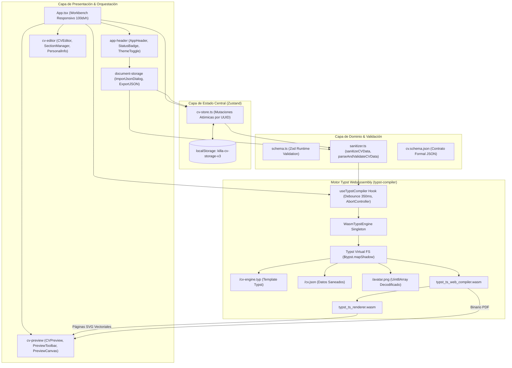

# 🏗️ Arquitectura del Sistema

Este documento describe la arquitectura integral de software, los patrones de diseño y el flujo de datos unidireccional de **Killa CV v2.0**.

---

## 1. Principios Arquitecturales Centrales

Killa CV se rige por cuatro axiomas de ingeniería para garantizar robustez, mantenibilidad y rendimiento óptimo:

### 1.1. Soberanía del Dato (Zero-Server Architecture)
La aplicación opera bajo un paradigma 100% Client-Side. No existen APIs intermedias, microservicios Node.js en producción ni transmisión de información sensible a servidores remotos. Toda la información personal, imágenes y maquetación documental ocurre dentro del sandbox del navegador del usuario.

### 1.2. Domain-Driven Design (DDD) y Vertical Slices
En lugar de una división horizontal genérica (como `components/`, `helpers/`), el código se distribuye verticalmente:
- **`src/domain/cv/`**: Núcleo de negocio desacoplado de React. Contiene esquemas de validación Zod, tipos TypeScript y utilidades de saneamiento.
- **`src/features/`**: Rebanadas verticales autónomas que encapsulan UI, hooks y lógica de casos de uso específicos (`cv-editor`, `cv-preview`, `typst-compiler`, `document-storage`, `app-header`).
- **`src/core/`**: Componentes atómicos de diseño y utilidades de infraestructura agnósticas de dominio.

### 1.3. Mutabilidad Inmutable con Identificadores Estables (UUID v4)
Para prevenir anomalías de reconciliación en React (como pérdida de foco al escribir o reordenamientos defectuosos), **todas las entidades** (secciones, contactos, entradas, categorías) poseen un identificador único e inmutable `_id`. Ninguna mutación se realiza por índice posicional.

### 1.4. Patrón Strategy para Secciones Polimórficas
El sistema trata las secciones del CV como una unión discriminada polimórfica (`tipo: "texto" | "entradas" | "agrupado" | "lista"`). Los editores de sección se registran en un mapa declarativo (`SectionRegistry`) eliminando bloques condicionales `switch/case` monolíticos.

---

## 2. Diagrama de Arquitectura Global



---

## 3. Desglose de Capas y Directorios

```
src/
├── app/
│   └── providers/
│       └── theme-provider.tsx          # Contexto de tema Cyber Lunar (claro/oscuro)
├── assets/
│   ├── cv-engine.typ                   # Motor tipográfico compilado para Typst v0.15+
│   └── cv.schema.json                  # JSON Schema formal v2020-12
├── core/                               # Núcleo de componentes base y hooks agnósticos
│   ├── hooks/                          # useDebounce, useMediaQuery
│   ├── lib/                            # download.ts, id.ts (UUIDv4), utils.ts (cn)
│   └── ui/                             # Primitivas atómicas (@base-ui/shadcn)
├── domain/cv/                          # Capa de Dominio Pura (TypeScript + Zod)
│   ├── schema.ts                       # Schemas Zod con inyección de UUIDs estables
│   ├── types.ts                        # Tipos e interfaces discriminadas
│   ├── defaults.ts                     # Datos de ejemplo (John Doe) y factories
│   ├── sanitizer.ts                    # Saneamiento de datos para compilación Typst
│   └── index.ts                        # Barrel export del dominio
├── features/                           # Vertical Slices de Funcionalidad
│   ├── app-header/                     # Branding, estado WASM y alternador de tema
│   ├── cv-editor/                      # Formulario personal y gestor polimórfico de secciones
│   ├── cv-preview/                     # Toolbar, zoom, canvas SVG y diálogo de error
│   ├── document-storage/               # Importación/Exportación JSON con Drag & Drop
│   └── typst-compiler/                 # Singleton WasmTypstEngine y hook reactivo
├── store/
│   └── cv-store.ts                     # Store centralizado Zustand con persistencia local
├── App.tsx                             # Orquestador del Workbench (< 80 líneas)
├── index.css                           # Tokens @theme Tailwind v4 y paleta OKLCH
└── main.tsx                            # Bootstrap de la aplicación React 19
```

---

## 4. Flujo de Datos Unidireccional

1. **Interacción:** El usuario modifica un campo de texto o añade una entrada en [`cv-editor`](https://github.com/Killa-Tech/killa-cv/tree/main/src/features/cv-editor).
2. **Mutación Atómica:** La acción invoca un método específico en [`cv-store.ts`](https://github.com/Killa-Tech/killa-cv/blob/main/src/store/cv-store.ts), garantizando mutación inmutable por UUID.
3. **Persistencia Automática:** Zustand sincroniza de inmediato el nuevo estado con `localStorage`.
4. **Debounce y Saneamiento:** El hook `useTypstCompiler` recibe los nuevos datos, espera un intervalo de reposo (350 ms) y ejecuta `sanitizeCVData()`, descartando identificadores internos y campos vacíos.
5. **Virtual FS y Compilación:** Los datos se inyectan en `/cv.json` dentro del sistema de archivos virtual en memoria de Typst, disparando la compilación a SVG y PDF sin I/O de disco.
6. **Renderizado:** [`cv-preview`](https://github.com/Killa-Tech/killa-cv/tree/main/src/features/cv-preview) actualiza las páginas SVG vectoriales en pantalla de forma no bloqueante.

Para ver a detalle cómo funciona el compilador interno, continúa en [[Motor Typst y WebAssembly|03-Motor-Typst-y-WASM]].
