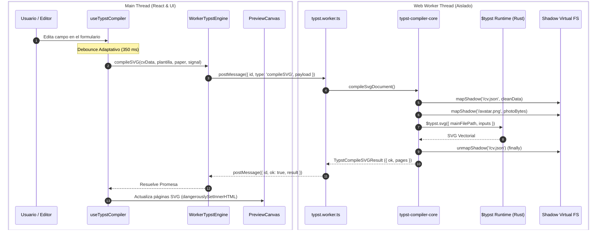

# ⚡ Motor Typst y WebAssembly (WASM)

Este documento detalla la arquitectura de compilación tipográfica client-side de **Killa CV**, implementada en [`src/features/typst-compiler/`](https://github.com/Killa-Tech/killa-cv/tree/main/src/features/typst-compiler).

---

## 1. La Transición a WebAssembly y Aislamiento en Web Worker

En iteraciones preliminares, el compilador Typst se ejecutaba en el hilo principal (*Main Thread*) de JavaScript o dependía de un subproceso Node.js. Esto presentaba dos limitaciones críticas:
1. **Bloqueo del Hilo Principal de la UI:** La compilación tipográfica en WebAssembly (WASM) es una operación intensiva en CPU (Rust). Al ejecutarse en el mismo hilo de React, producía micro-congelamientos en la interfaz y caída de FPS mientras el usuario completaba los formularios.
2. **Imposibilidad de Liberar Memoria en WASM:** Por diseño de la plataforma web, la memoria lineal asignada a WebAssembly (`memory.grow`) **nunca** se devuelve al sistema operativo mientras el contexto de ejecución siga vivo, lo que inflaba el heap del proceso de la pestaña.

**Killa CV v2.0** resuelve ambos problemas desacoplando el runtime completo de Typst en un **Web Worker dedicado** (`typst.worker.ts`), permitiendo que el hilo de React se mantenga 100% libre (~15-20 MB de RAM base) a 60/120 FPS constantes, con capacidad de purga total de memoria.

---

## 2. Arquitectura Modular del Motor (`engine/`)

Para evitar archivos monolíticos y respetar el principio de responsabilidad única (*Single Responsibility Principle*), el motor se divide en cuatro módulos especializados:

```
src/features/typst-compiler/engine/
├── types.ts                # Interfaces de dominio (TypstCompilerEngine, TypstCompileSVGResult, etc.)
├── wasm-engine.ts          # Cliente puente en el Main Thread (WorkerTypstEngine) con purga de memoria
├── typst.worker.ts         # Enrutador delgado de eventos del Web Worker (self.onmessage)
├── typst-compiler-core.ts  # Runtime puro de Typst WASM, inicialización y compilación SVG/PDF
└── avatar-processor.ts     # Decodificación binaria de imágenes (magic bytes) y Shadow FS
```

### 2.1. `wasm-engine.ts` (Cliente en el Hilo Principal)
Implementa la interfaz `TypstCompilerEngine` mediante la clase `WorkerTypstEngine`. Actúa como puente entre React y el Worker:
- Instancia el Worker de forma nativa con ESM de Vite: `new Worker(new URL('./typst.worker.ts', import.meta.url), { type: 'module' })`.
- Mantiene un mapa de peticiones pendientes correlacionadas por identificador único `id`.
- Sincroniza la cancelación reactiva mediante `AbortSignal`: si una compilación se aborta, la promesa se rechaza de inmediato sin esperar al Worker.
- Implementa la **política de reciclaje de memoria por inactividad** (*Idle Purge*).

### 2.2. `typst.worker.ts` (Enrutador del Worker)
Es un dispatcher liviano (< 30 líneas) que escucha eventos en `self.onmessage`, delega la ejecución al módulo correspondiente y responde con `postMessage`.

### 2.3. `typst-compiler-core.ts` (Runtime y Compilación)
Contiene las funciones puras de compilación sin acoplamiento a React:
- **`initTypstEngine()`**: Configura los binarios WASM (`typst_ts_web_compiler_bg.wasm` y `typst_ts_renderer_bg.wasm`), precarga las variantes de fuentes *Liberation Sans* (Regular, Bold, Italic) y monta el template maestro `/cv-engine.typ`.
- **`compileSvgDocument()`**: Sanea el estado del CV, mapea `/cv.json`, invoca `$typst.svg()` y extrae las páginas vectoriales.
- **`compilePdfDocument()`**: Genera el buffer binario `Uint8Array` listo para exportación mediante `$typst.pdf()`.

### 2.4. `avatar-processor.ts` (Procesamiento Binario de Imágenes)
Encapsula la validación y transformación de imágenes para Typst:
- **`decodeAvatarDataUri()`**: Convierte cadenas Base64 a `Uint8Array` e inspecciona los primeros bytes del archivo (*magic bytes*) para garantizar la extensión real (`.jpg`, `.png`, `.webp`, `.gif`), previniendo errores de decodificación en Rust.
- **`prepareAvatar()` / `cleanupVirtualAvatars()`**: Gestiona el mapeo de la foto en `/avatar.<extension>` dentro del Virtual FS y desmonta variantes obsoletas.

---

## 3. Sistema de Archivos Virtual en Memoria (Virtual FS) y Limpieza

Typst requiere acceder a plantillas, datos y recursos como si existieran en un disco físico. Typst WebAssembly soluciona esto con un **Virtual File System** en memoria gestionado por `$typst.mapShadow`:

```
┌────────────────────────────────────────────────────────┐
│               TYPST SHADOW VIRTUAL FS                  │
├────────────────────────────────────────────────────────┤
│ /cv-engine.typ   <- Código fuente Typst (plantilla)    │
│ /cv.json         <- JSON saneado con datos de usuario  │
│ /avatar.png      <- Uint8Array binario de fotografía   │
└────────────────────────────────────────────────────────┘
```

### 3.1. Template Maestro (`/cv-engine.typ`)
Se importa en crudo (`?raw`) durante la inicialización y se mapea una única vez:
```typescript
const encoder = new TextEncoder()
await $typst.mapShadow('/cv-engine.typ', encoder.encode(cvEngineSource))
```

### 3.2. Prevención de Fugas de Memoria (`unmapShadow`)
En cada compilación, los datos se serializan y se mapean en `/cv.json`. Para evitar la acumulación progresiva de memoria en el heap de WebAssembly a lo largo de cientos de ediciones:
```typescript
try {
  // Compilar documento...
} finally {
  try {
    await $typst.unmapShadow('/cv.json')
  } catch {
    // Ignorar si ya fue desmontado
  }
}
```

---

## 4. Política de Purga y Reciclaje de Memoria (Idle Memory Purge)

Uno de los mayores desafíos en aplicaciones web con WebAssembly es que una vez que el motor de Rust aloja memoria (`memory.grow`), el navegador **no la libera** mientras el hilo permanezca abierto.

Para garantizar estabilidad a largo plazo:
1. `WorkerTypstEngine` inicia un temporizador de inactividad de **5 minutos** (`IDLE_PURGE_TIMEOUT_MS = 300_000`) cada vez que finaliza una compilación.
2. Si el usuario no realiza cambios durante 5 minutos, se ejecuta automáticamente:
   ```typescript
   this.worker.terminate()
   this.worker = null
   ```
3. Esto destruye el contexto del Web Worker por completo y **devuelve el 100% de la memoria RAM del compilador al sistema operativo**.
4. Tan pronto como el usuario vuelva a editar un campo, el cliente recrea transparentemente el Worker bajo demanda sin interrupción visual.

---

## 5. Ciclo de Compilación Reactivo y Paralelo



### 5.1. Debounce Adaptativo (350 ms)
Para prevenir saturación ante mecanografía rápida, el hook `useTypstCompiler` retrasa la emisión del payload debounced 350 milisegundos.

### 5.2. Concurrencia y Cancelación con `AbortController`
Si el usuario pulsa teclas consecutivas o conmuta de plantilla antes de que termine una compilación en curso:
1. `abortControllerRef.current.abort()` señaliza la cancelación.
2. La promesa del cliente se rechaza inmediatamente con `AbortError`.
3. Cuando el Worker finaliza la tarea antigua, su respuesta se descarta limpiamente por descarte de `id`, garantizando que la UI solo dibuje el estado más reciente.

### 5.3. Carga Perezosa (Lazy Loading) y Montaje Responsivo
- **Eliminación del arranque ansioso:** Se eliminó la verificación de estado automática en el montaje de la app. El motor WASM solo se descarga y ejecuta cuando se requiere compilar el documento por primera vez.
- **Montaje condicional en Mobile:** En `App.tsx`, el componente `CVPreview` se evalúa mediante `useMediaQuery('(min-width: 1024px)')`. En pantallas de teléfono móvil, el componente no se monta mientras el usuario se encuentre en la pestaña del editor, ahorrando ~28 MB de descarga de datos en dispositivos móviles.

---

## 6. Compilación a SVG vs. Compilación a PDF

- **Compilación a SVG (`compileSVG`):** Destinada a la previsualización interactiva. Typst produce páginas vectoriales nítidas que se inyectan en el DOM (`dangerouslySetInnerHTML`), preservando la nitidez al cambiar el zoom (0.5x - 2.0x).
- **Compilación a PDF (`compilePDF`):** Invocada al pulsar **Descargar PDF**. Genera un buffer binario `Uint8Array` nativo sin intermediarios de servidor, transferido desde el Worker al hilo principal para descarga inmediata mediante un `Blob`.

Para conocer cómo se validan y formatean los datos enviados a este motor, continúa en [[Especificación JSON Schema|04-Especificacion-JSON-Schema]].
