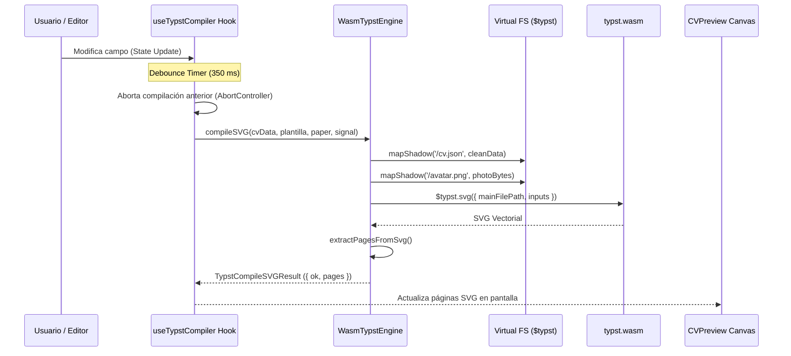

# ⚡ Motor Typst y WebAssembly (WASM)

Este documento detalla el funcionamiento interno del motor de compilación tipográfica client-side de **Killa CV**, implementado en [`src/features/typst-compiler/`](https://github.com/Killa-Tech/killa-cv/tree/main/src/features/typst-compiler).

---

## 1. La Transición a WebAssembly

En iteraciones preliminares, el proyecto dependía de un proceso secundario en Node.js mediante `child_process.execFile("typst", ...)`. Como se documentó en el informe de QA, ese enfoque colapsaba en entornos estáticos (Vercel, GitHub Pages) y durante `pnpm preview`.

Killa CV v2.0 eliminó toda dependencia del sistema anfitrión trasladando el compilador oficial de **Typst v0.15+** directamente al motor JavaScript del navegador mediante los paquetes WebAssembly de `@myriaddreamin/typst.ts`:
- `@myriaddreamin/typst-ts-web-compiler`: Compila código fuente `.typ` y archivos de datos a formatos intermedios y binarios PDF.
- `@myriaddreamin/typst-ts-renderer`: Renderiza los artefactos intermedios en vectores SVG nítidos para previsualización instantánea.

---

## 2. Inicialización Lazy de Binarios WASM

Los binarios WASM (`typst_ts_web_compiler_bg.wasm` y `typst_ts_renderer_bg.wasm`) se empaquetan como assets estáticos administrados por Vite (`?url`). 

La clase [`WasmTypstEngine`](https://github.com/Killa-Tech/killa-cv/blob/main/src/features/typst-compiler/engine/wasm-engine.ts) implementa un patrón Singleton con inicialización perezosa (*lazy initialization*):

```typescript
// Configuración de módulos WebAssembly en WasmTypstEngine
$typst.setCompilerInitOptions({
  getModule: () => compilerWasmUrl,
})
$typst.setRendererInitOptions({
  getModule: () => rendererWasmUrl,
})
```

La inicialización se ejecuta únicamente cuando el usuario accede a la vista de edición o previsualización, previniendo descargas de red innecesarias en la carga inicial de la aplicación.

---

## 3. Sistema de Archivos Virtual en Memoria (Virtual FS)

Typst necesita acceder a fuentes tipográficas, plantillas e imágenes como si estuvieran en un sistema de archivos tradicional. Typst WebAssembly resuelve esto mediante un **Virtual File System** en memoria gestionado por `$typst.mapShadow`:

```
┌────────────────────────────────────────────────────────┐
│               TYPST SHADOW VIRTUAL FS                  │
├────────────────────────────────────────────────────────┤
│ /cv-engine.typ   <- Código fuente Typst (plantilla)    │
│ /cv.json         <- JSON saneado con datos de usuario  │
│ /avatar.png      <- Uint8Array binario de fotografía   │
└────────────────────────────────────────────────────────┘
```

### 3.1. Template Maestro (`/cv-engine.typ`)
El archivo [`src/assets/cv-engine.typ`](https://github.com/Killa-Tech/killa-cv/blob/main/src/assets/cv-engine.typ) se importa en crudo (`?raw`) durante la inicialización y se mapea en la raíz virtual:
```typescript
const encoder = new TextEncoder()
await $typst.mapShadow('/cv-engine.typ', encoder.encode(cvEngineSource))
```

### 3.2. Datos de Usuario (`/cv.json`)
Antes de cada ciclo de compilación, el objeto de estado del CV se sanea mediante `sanitizeCVData(cvData)`, se serializa a JSON y se escribe en `/cv.json`. Typst lee este archivo dinámicamente con `#let cv-data = json("/cv.json")`.

### 3.3. Procesamiento Binario del Avatar (`/avatar.png`)
Si el usuario cargó una fotografía como Data URI Base64 (`data:image/...;base64,...`), el motor no envía cadenas largas de texto a Typst. En su lugar:
1. Convierte el string Base64 a un buffer de bytes `Uint8Array`.
2. Lo mapea en `$typst.mapShadow('/avatar.png', photoBytes)`.
3. Reemplaza la ruta en los datos a `/avatar.png`, permitiendo que Typst la dibuje nativamente con `#image("/avatar.png")`.
4. Si el usuario elimina la fotografía, se invoca `$typst.unmapShadow('/avatar.png')` para liberar la memoria WebAssembly.

---

## 4. Ciclo de Compilación Reactivo



### 4.1. Debounce Adaptativo (350 ms)
Para evitar bloqueos o saturación del hilo principal mientras el usuario tipea texto en el formulario, el hook `useTypstCompiler` aplica un temporizador debounce de 350 milisegundos.

### 4.2. Concurrencia y Cancelación con `AbortController`
Si el usuario tipea rápidamente o conmuta entre plantillas antes de que finalice la compilación anterior:
1. La señal `AbortSignal` activa la cancelación inmediata de la promesa en curso.
2. Se descarta el resultado obsoleto para prevenir condiciones de carrera (*race conditions*).
3. Se inicia la compilación más reciente.

### 4.3. Compilación a SVG vs. Compilación a PDF
- **Compilación a SVG (`compileSVG`):** Utilizada por la vista previa en pantalla. Produce cadenas SVG vectoriales que se inyectan en el DOM manteniendo una nitidez absoluta a cualquier nivel de zoom.
- **Compilación a PDF (`compilePDF`):** Invocada al hacer clic en **Descargar PDF**. Genera un buffer binario `Uint8Array` nativo que se descarga a través de un `Blob` sin intermediarios externos.

Para conocer cómo se validan y formatean los datos enviados a este motor, continúa en [[Especificación JSON Schema|04-Especificacion-JSON-Schema]].
